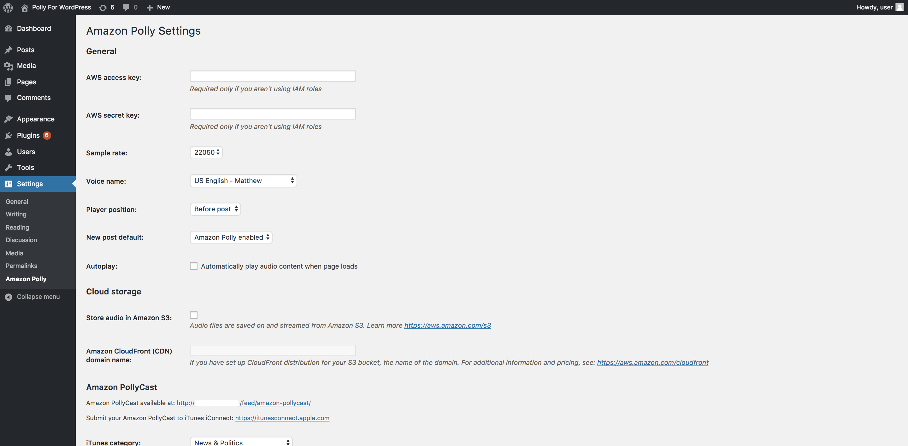
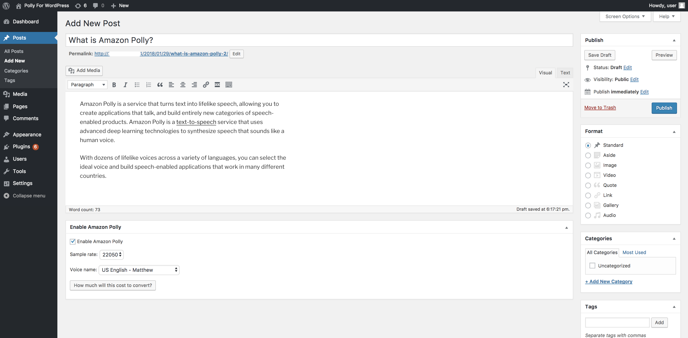
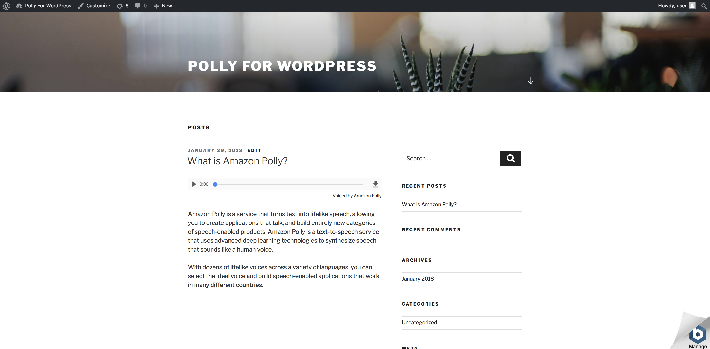

# AWS Polly WordPress Plugin: Text-to-Speech

The plugin adds text-to-speech support to WordPress through Amazon Polly. After AWS and synthesis settings are configured, it generates an audio version of a post and displays a built-in player on the public page.

## What the TTS part of the plugin does

- enables audio generation for the site and for individual posts;
- lets you choose the source language, voice, and `Standard` or `Neural` engine;
- supports additional settings such as `Speaking Style`, `SSML`, `Lexicons`, `Audio speed`, and `Automated breaths`;
- controls player behavior, including position, label, `autoplay`, and the download button;
- can store audio files locally or in `Amazon S3`, with optional delivery through `CloudFront`.

## Minimum setup to start generating audio

1. In the `AWS` section, configure AWS access:
   - provide `AWS access key`, `AWS secret key`, and `AWS Region`;
   - if you want to store audio in S3, also configure the `Amazon S3 bucket name`.
2. Instead of entering these values in the WordPress admin, you can define them in PHP constants, for example in `wp-config.php`:

```php
define('AWS_POLLY_S3_ACCESS_KEY', 'your-access-key');
define('AWS_POLLY_S3_SECRET_KEY', 'your-secret-key');
define('AWS_POLLY_S3_BUCKET_NAME', 'your-bucket-name');
define('AWS_POLLY_S3_REGION', 'us-east-1');
```

If these constants are defined, the related fields in the plugin settings are disabled and the constant values are used instead.

3. In the `Text-To-Speech` section:
   - set the `Source language`;
   - enable `Enable text-to-speech support`;
   - choose the global voice and other synthesis options you need.
4. Decide how posts will be opted in:
   - enable `New post default: Amazon Polly enabled` if new posts should have TTS preselected by default;
   - or enable `Enable Text-To-Speech (Amazon Polly)` manually in each post.
5. Save or update the post so the plugin can queue background audio generation.

Important:

- The plugin does not automatically generate audio for all existing posts right after setup.
- Audio is generated only for supported post types that are saved after TTS is configured and have `Enable Text-To-Speech (Amazon Polly)` enabled.
- Existing posts created before setup will not receive audio until you open them and update them.
- If post content changes later, the plugin regenerates the audio for that post.

## Screenshots

### 1. Global Text-to-Speech settings



This screen contains the main TTS settings: AWS access, sample rate, default voice, player position, default behavior for new posts, and audio storage options.

### 2. Enabling TTS for a single post



In the post editor, you can enable audio generation for a specific post, choose a voice, and estimate the conversion cost.

### 3. Player on the public page



After the audio is generated, an embedded HTML5 player appears on the post page so visitors can listen to the content directly on the site.

## Summary

From a text-to-speech perspective, the plugin covers the full basic flow: configuring Amazon Polly, selecting a voice, generating audio automatically, and playing it back on the WordPress frontend.
